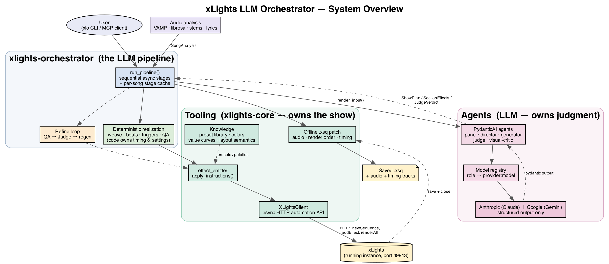
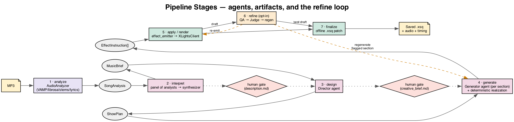
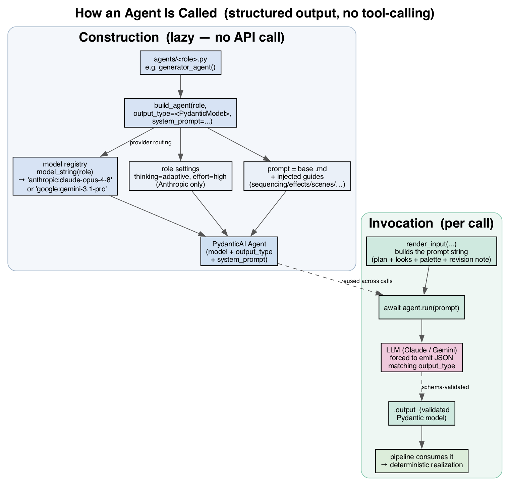
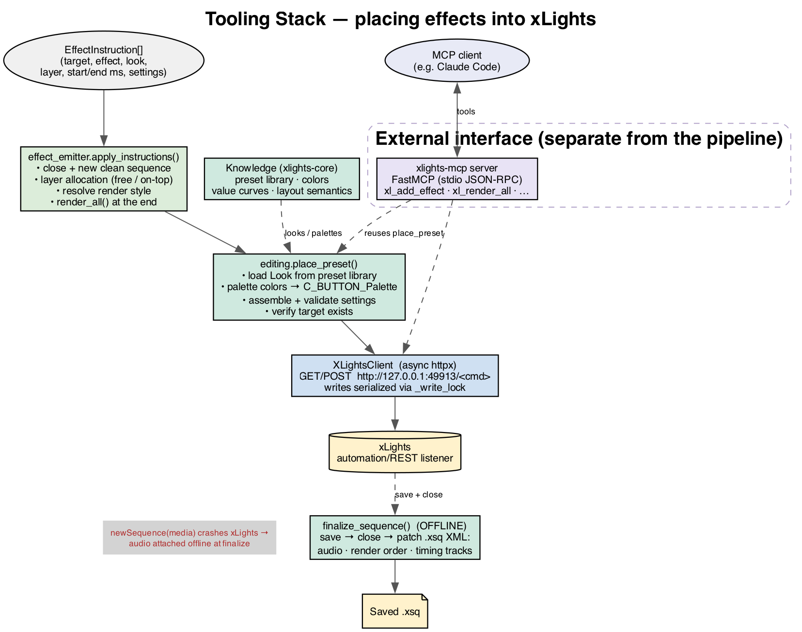

# Architecture

How the xLights LLM Orchestrator is put together — the pipeline, how it calls LLM **agents**, and
how it drives the xLights **tooling**. Diagrams are committed as PNGs under
[`diagrams/`](diagrams/) (rendered from the Graphviz `.dot` sources beside them — see
[Regenerating the diagrams](#regenerating-the-diagrams)).

- [The big picture](#the-big-picture)
- [The pipeline](#the-pipeline)
- [Calling agents](#calling-agents)
- [Calling tooling](#calling-tooling)
- [Cross-cutting concerns](#cross-cutting-concerns)
- [Regenerating the diagrams](#regenerating-the-diagrams)

---

## The big picture



The system is a [uv](https://docs.astral.sh/uv/) workspace of three packages, split by
responsibility:

| Package | Responsibility |
| --- | --- |
| [`xlights-core`](../../packages/xlights-core) | The **tooling**: async REST client for xLights, audio analysis (VAMP/librosa/stems/lyrics), the mined effect-preset library, colors / value curves, and layout semantics. No LLM dependencies. |
| [`xlights-orchestrator`](../../packages/xlights-orchestrator) | The **pipeline**: the LLM agents, the deterministic weave/beat/trigger realization layers, the refine loop, and the `xlo` CLI. |
| [`xlights-mcp`](../../packages/xlights-mcp) | A FastMCP server that exposes xLights read/edit operations as MCP **tools** for external clients (e.g. Claude Code). Independent of the pipeline. |

The organizing principle, stated throughout the code: **the LLM owns judgment** (themes, palette,
section design, effect recipes) and **code owns realization** (timing snapped to the beat grid,
palettes → real settings strings, render order, brightness, sparsity). Agents return *recipes*;
deterministic code turns them into thousands of concrete, beat-aligned effects.

---

## The pipeline

[`pipeline/run.py`](../../packages/xlights-orchestrator/src/xlights_orchestrator/pipeline/run.py)
is a plain sequential async function — no graph engine — over a typed
[`State`](../../packages/xlights-orchestrator/src/xlights_orchestrator/pipeline/state.py)
"blackboard". Each stage's artifact is cached on disk, keyed by the song's content hash, so a re-run
resumes instead of recomputing.



| # | Stage | Runs | In → Out | Cache key |
| --- | --- | --- | --- | --- |
| 1 | **analyze** | `AudioAnalyzer` (VAMP/librosa, optional stems + Genius lyrics) | MP3 → `SongAnalysis` | `song_analysis` |
| 2 | **interpret** | a **panel** of analyst agents → a **synthesizer** agent | `SongAnalysis` → `MusicBrief` | `song_description` |
| 3 | **design** | the **Director** agent | `MusicBrief` → `ShowPlan` (sections, concept, palette, motifs) | `creative_brief` |
| 4 | **generate** | the **Generator** agent, once per section, + deterministic realization | `ShowPlan` → `EffectInstruction[]` | `instructions` |
| 5 | **apply / render** | `effect_emitter` → `XLightsClient` | `EffectInstruction[]` → live animation + `.fseq` | — |
| 6 | **refine** *(opt-in)* | QA checks → **Judge** agent → regenerate flagged sections | draft → improved draft | per-iteration log |
| 7 | **finalize** | offline `.xsq` patch | open sequence → saved `.xsq` + audio + timing | — |

Two optional **human checkpoints** (dotted in the diagram) gate the run when not in `--auto` mode:
after *interpret* (review `description.md`) and after *design* (review `creative_brief.md`, which is
also editable via `xlo edit-brief`).

The **refine loop** (stage 6) is where the multi-agent structure shows: it renders the draft, scores
it with deterministic QA, optionally adds a multimodal **visual critique**, asks the **Judge** for
scoped revisions, regenerates only the flagged sections, re-emits, and keeps the best draft. It is
bounded (hard iteration cap + plateau/stall detection) and always leaves a valid sequence.

---

## Calling agents

All agents are [PydanticAI](https://ai.pydantic.dev) `Agent`s. The defining choice: **agents use
structured output, not tool-calling.** Each agent is constructed with an `output_type` (a Pydantic
model), and the LLM is forced to emit JSON that validates against it. There are no `@tool`
registrations on the agents — the "tools" (xLights) are driven by deterministic code *after* the
agent returns, not called by the model.



### Construction — one factory, config-driven routing

Every agent is built through
[`build_agent()`](../../packages/xlights-orchestrator/src/xlights_orchestrator/models/registry.py):

```python
def build_agent(role, *, output_type, system_prompt):
    return Agent(
        model_string(role),          # "anthropic:claude-opus-4-8" | "google:gemini-3.1-pro-preview"
        output_type=output_type,     # a Pydantic model — the forced output schema
        system_prompt=system_prompt, # base prompt + injected guides
        model_settings=_settings(role),
    )
```

- **Provider routing** lives in
  [`models/config.yaml`](../../packages/xlights-orchestrator/src/xlights_orchestrator/models/config.yaml).
  Each *role* lists a model per provider; the active provider is `default_provider` (Anthropic)
  unless overridden by `XLO_PROVIDER=gemini`. No code change to switch providers.
- **Settings** (`_settings`) apply Anthropic-only knobs (`thinking: adaptive`, `effort: high`) for
  planner-tier roles; Gemini uses provider defaults.
- Construction is **lazy** — no network call until `.run()`.

### The agents

| Agent | Input (`render_input`) | Output type | Tier | Called from |
| --- | --- | --- | --- | --- |
| **panel** (analysts) | focused slices of `SongAnalysis` (structure / rhythm / harmony / lyrics) | `StructureOut`, `RhythmOut`, `HarmonyOut`, `LyricOut` | worker | `interpret` (concurrent) |
| **synthesizer** | the analysts' outputs | `MusicBrief` | planner | `interpret` |
| **director** | `MusicBrief` + available groups + placeable effect types | `ShowPlan` | planner | `design` |
| **section_redesigner** | one `SectionPlan` + findings | `SectionPlan` | planner | `refine` (design escalation) |
| **generator** | one `SectionPlan` (+ optional revision note, concept, motifs) | `SectionEffects` (instructions + weave + composites) | worker | `generate` (per section) |
| **judge** | the QA report + plan + brief + do-not-repeat ledger | `JudgeVerdict` (score + verdict + scoped revisions) | planner | `refine` |
| **visual_critic** | rendered stills (PNG) + clips (MP4) per section + musical context | `VisualFindings` | planner / vision | `refine` (when a real render exists) |

### Prompt assembly — the editable "voice"

System prompts are a base markdown file plus **guides** injected at construction by
[`with_guides()`](../../packages/xlights-orchestrator/src/xlights_orchestrator/agents/guide.py). The
guides are the hand-editable corpus at the repo root (`xlights-sequencing-guide.md`,
`xlights-effects-catalog.md`, `xlights-layering-rendering-guide.md`, `xlights-scene-cookbook.md`,
`xlights-trigger-cookbook.md`); each is resolvable via an env var. The Director carries the full
corpus; the Generator gets compact *extracts* plus, per section, only the one named scene recipe it
needs. A missing guide is skipped, not an error.

### A call, end to end (the generator)

1. `generate_instructions()` lazily builds the generator agent.
2. For each section: `render_input(section, concept=…, motifs=…)` assembles a prompt string (plan +
   candidate look-ids + palette menu + scene note + any revision note).
3. `out = (await agent.run(prompt)).output` — a schema-validated `SectionEffects`.
4. Deterministic code **realizes** it: energy-gated coverage, palette → settings, brightness/speed,
   the ensemble bed / peak fill, the woven cell fabric, beat accents, composites — every effect
   tagged with its `section_index` for scoped regeneration and QA.

That hand-off — agent returns the *recipe*, code produces the *effects* — is the architectural seam
between the two halves of the system.

---

## Calling tooling

"Tooling" is everything that actually talks to xLights. The pipeline drives it through a layered
stack; an MCP server exposes the same primitives to external clients in parallel.



### The layers

1. **`effect_emitter.apply_instructions()`**
   ([effect_emitter.py](../../packages/xlights-orchestrator/src/xlights_orchestrator/effect_emitter.py))
   — turns `EffectInstruction[]` into a live sequence: close any open sequence then create a clean
   one, allocate layers (lowest free layer for normal effects; *above* everything for `on_top`
   punch-through accents), resolve each effect's render/buffer style, place each effect, and
   `renderAll()` once at the end.
2. **`editing.place_preset()`**
   ([editing.py](../../packages/xlights-core/src/xlights_core/editing.py)) — the single-effect
   primitive: load a *Look* from the preset library, realize palette colors into an xLights palette
   string, assemble + validate the settings, verify the target exists, and call `add_effect`.
3. **`XLightsClient`** ([client.py](../../packages/xlights-core/src/xlights_core/client.py)) — the
   transport: an async `httpx` client over the xLights **automation/REST API**
   (`http://127.0.0.1:49913` by default; instance "B" uses 49914). Reads
   (`getModels`, `getShowFolder`, …) run freely; **all writes** (`newSequence`, `addEffect`,
   `saveSequence`, `renderAll`, …) are **serialized through a single `_write_lock`** because xLights
   has exactly one open sequence and concurrent mutations corrupt it.
4. **xLights** — the running instance with its automation listener enabled.

**Knowledge** modules in `xlights-core` feed the editing layer as reference data: the mined
**preset library** (effect looks + 8-color palettes), **colors** (named → hex, palette assembly),
**value curves** (parametric brightness/motion ramps), and **layout semantics** (prop roles, bands,
sides, and the canonical `SEM_*` groups).

### Why finalize is offline

Three things **cannot** be set through the live API and are patched into the saved `.xsq` XML offline
in [`finalize_sequence()`](../../packages/xlights-orchestrator/src/xlights_orchestrator/pipeline/finalize.py)
after the animation is saved and closed:

- **audio** — `newSequence(mediaFile=…)` pops a `LoadAudioData` modal that hangs xLights, so the
  sequence is built media-less and the song is patched in afterward;
- **render order** — model rows are reordered canonically (beds under features; timing rows stay on
  top);
- **timing tracks** — Section/Beat/Bar/Onset/Chord/Lyric reference grids are injected as timing rows.

All offline patches are best-effort and never fail the run.

### The MCP server

[`xlights-mcp`](../../packages/xlights-mcp/src/xlights_mcp/server.py) is a **separate interface**, not
part of the pipeline. It is a FastMCP server (stdio JSON-RPC) that wraps the same `XLightsClient` and
`place_preset` primitives as MCP tools (`xl_get_models`, `xl_add_effect`, `xl_validate_preset`,
`xl_render_all`, …) so an external MCP client like Claude Code can drive xLights interactively. It
holds one shared client for its lifetime and surfaces domain errors as typed tool errors.

---

## Cross-cutting concerns

- **Caching / resume.** Stage artifacts are keyed by the song's content hash under
  `data/orchestrator/<song_key>/`. Re-runs reuse `SongAnalysis`, `MusicBrief`, `ShowPlan`, and
  `EffectInstruction[]` unless `--no-cache`.
- **Two failure philosophies.** Enrichment (lyrics, stems, visual critique, offline patches)
  degrades gracefully and never blocks a run; the objective QA gate is the only thing that reverts a
  refine revision.
- **Determinism where it counts.** Given the same agent outputs, realization is fully deterministic
  (timing, palette, layering) — which is what makes the golden-pipeline snapshot test and scoped
  single-section regeneration possible.
- **Provider portability.** Anthropic (Claude) and Google (Gemini) are both first-class via the
  registry; `TestModel` stands in for hermetic tests (no API key, no network).
- **Auth.** The orchestrator needs its own LLM key (`ANTHROPIC_API_KEY` and/or `GEMINI_API_KEY`);
  there is no shared session with an external Claude.

---

## Regenerating the diagrams

The PNGs are generated from the Graphviz sources beside them. With
[Graphviz](https://graphviz.org) installed (`brew install graphviz`):

```bash
cd docs/architecture/diagrams
for f in system-overview pipeline-stages agent-invocation tooling-stack; do
  dot -Tpng -Gdpi=140 "$f.dot" -o "$f.png"
done
```

Edit the `.dot` source and re-render to update a diagram; commit both the source and the PNG.
